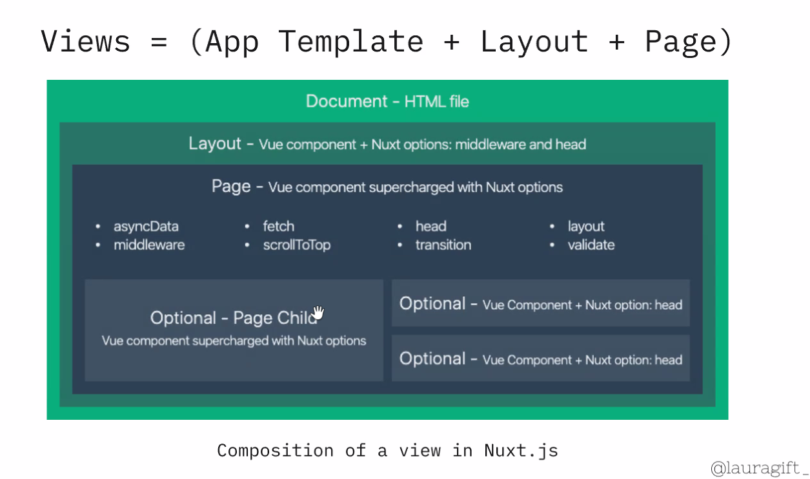

# PAGES

This directory contains your Application Views and Routes.
The framework reads all the `*.vue` files inside this directory and creates the router of your application.

More information about the usage of this directory in [the documentation](https://nuxtjs.org/guide/routing).
---
```javascript
export default {
  layout: "Blog",
};
```
## View


## Routing


